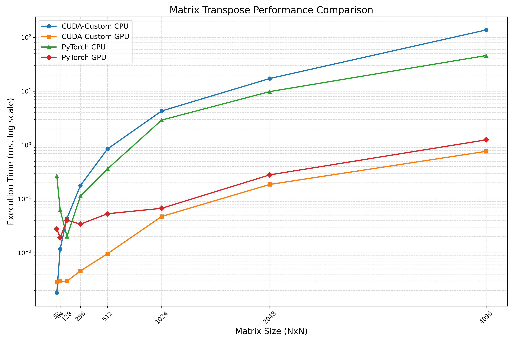
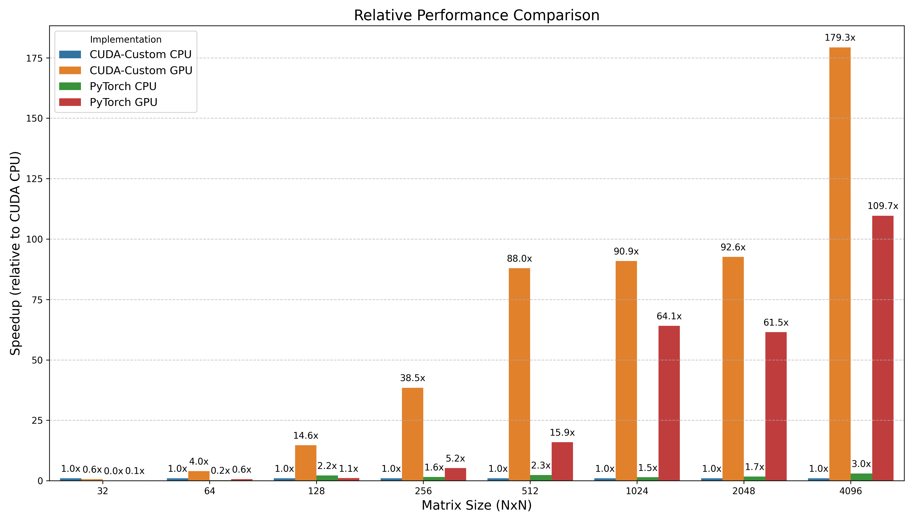
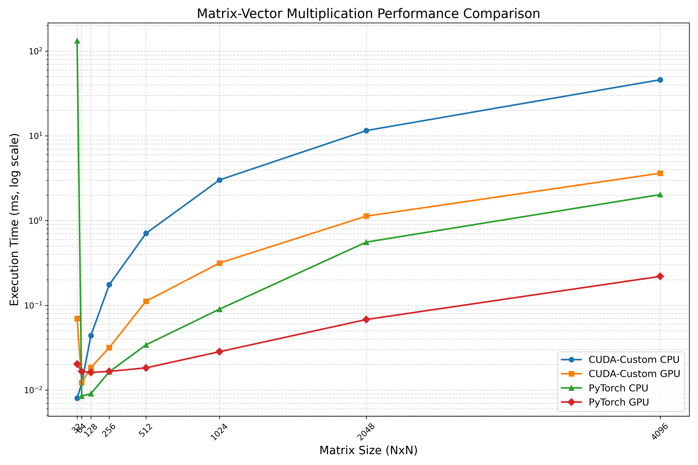

# 100 Days of CUDA Learning

This repository contains my journey of learning CUDA over 100 days.

## Run 

cmake ..
make
./days/day001/day001_vector_add

OR

./run.sh Daynumber

For example for running day-02 :
./run.sh 2

## Project Structure

- `common/`: Common utility code used across multiple days
- `days/`: Individual daily exercises and experiments
- `projects/`: Larger mini-projects spanning multiple days
- `data/`: Sample data for projects
- `tests/`: Unit tests
- `docs/`: Documentation and learning notes

## Progress

| Day | Topic | Status |
|-----|-------|--------|
| 001 | Vector Addition | Completed |
| 002 | Matrix Multiplication | Completed |
| 003 | Matrix Addition | Completed |
| 004 | Matrix Scalar Multiplication | Completed |
| 005 | Matrix Transpose | Completed |
| 006 | Matrix Vector Multiplication | Completed |
| 007 | (Optimized) Matrix Vector Multiplication | Completed |
| 008 | (Optimized) Matrix Transpose | Completed |

## Comparison charts
### Day-3

### Day-4

### Day-5

### Day-6

### Day-7

#### Same as day006 but optimized with shared memory concept.

### Day-8

#### Same as day005 but optimized with shared memory concept.

### Day-9

#### optimized with shared memory concept.

